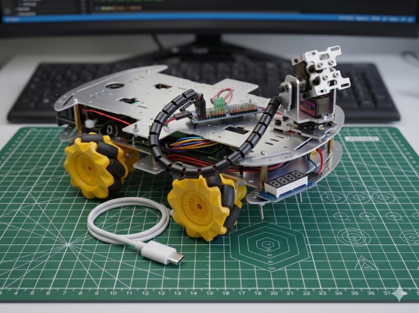

# Simple and cheap omniwheel car

Simple and cheap omniwheel car project detailed in this repository.  
There are two version made for two different microcontrollers:
 - ESP32 microcontroller
 - Raspberry Pi SBC

## Bill of Materials

| Component                     | Quantity | Unit Price (€) | Total (€) | Notes                             |
|------------------------------|----------|----------------|-----------|------------------------------------|
| Chassis + wheels + motors    | 1        | 20.79          | 20.79     |                                    |
| Microcontroller              | 1        | 11.49          | 11.49     | Pre-soldered ESP32-S3 CAM N16R8    |
| Motor driver                 | 1        | 1.44           | 1.44      | L9110S (4-channel)                 |
| Arm driver                   | 1        | 2.79           | 2.79      | PCA9685 (16-channel)               |
| Power supply                 | 1        | 31.19          | 31.19     | Waveshare UPS 3S (no batteries)    |
| Battery (18650)              | 3        | 2.39           | 7.16      | 3× cells                           |
| Misc (wires, screws)         | 1        | 2.46           | 2.46      | Approximation                      |
| **Total**                    |          |                | **77.32** |                                    |

## ESP32S3 CAM 

| Name                                 | Value                                |
| ------------------------------------ | ------------------------------------ |
| Board                                | **ESP32S3 Dev Module**               |
| Port                                 | Your port                            |
| CPU Frequency                        | 240MHZ(WiFi)                         |
| Core Debug Level                     | None                                 |
| Erase All Flash Before Sketch Upload | Disable                              |
| Events Run On                        | Core1                                |
| Flash Mode                           | QIO 80MHz                            |
| Flash Size                           | **16MB(128Mb)**                      |
| JTAG Adapter                         | Disabled                             |
| Arduino Runs On                      | Core1                                |
| Partition Scheme                     | **16M Flash (3MB APP/9.9MB FATFS)**  |
| PSRAM                                | **OPI SPRAM**                        |
| Upload Speed                         | 921600                               |
| Programmer                           | **Esptool**                          |
