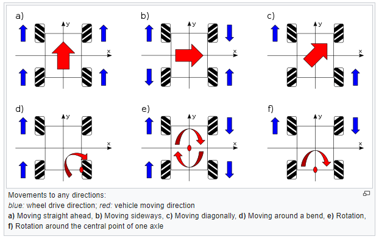

# Simple and cheap omniwheel car
Simple and cheap omniwheel car project detailed in this repository.

## Bill of Materials

| Component                     | Quantity | Unit Price (€) | Total (€) | Notes                              |
|------------------------------|----------|----------------|-----------|------------------------------------|
| Chassis + wheels + motors    | 1        | 20.79          | 20.79     |                                    |
| Microcontroller              | 1        | 11.49          | 11.49     | Pre-soldered ESP32-S3              |
| Motor driver                 | 1        | 1.44           | 1.44      | L9110S (4-channel)                 |
| Arm driver                   | 1        | 2.79           | 2.79      | PCA9685 (16-channel)               |
| Power supply                 | 1        | 31.19          | 31.19     | Waveshare UPS 3S (no batteries)    |
| Battery (18650)              | 3        | 2.39           | 7.16      | 3× cells                           |
| Misc (wires, screws)         | 1        | 2.46           | 2.46      | Approximation                      |
| **Total**                    |          |                | **77.32** |                                    |

